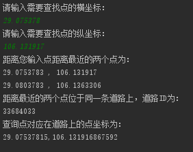

**基于KDTree的KNN算法**

**1. KDTree介绍**

KDTree是根据m维空间中的数据集D构建的二叉树，能加快搜索速度，常用于最近邻查找。其节点具有如下属性：

**非叶子节点（不存储数据）：**

| partitionDimension                     | 用于分割的维度，取值范围为1,2,…,m                                                                               |
|----------------------------------------|-----------------------------------------------------------------------------------------------------------------|
| partitionValue                         | 用于分割的值v，当数据点在维度partitionDimension上的值小于v时，被分到左节点，否则分到右节点                      |
| left                                   | 左节点，使用分到该节点的数据集构建                                                                              |
| right                                  | 右节点，使用分到该节点的数据集构建                                                                              |
| Max（以及min，是加快最近邻查找的关键） | 用于构建该节点的数据集（也可以说是该节点的所有叶子节点包含的数据组成的数据集）在各个维度上的最大值组成的d维向量 |
| Min                                    | 用于构建该节点的数据集（也可以说是该节点的所有叶子节点包含的数据组成的数据集）在各个维度上的最小值组成的d维向量 |

**叶子节点：**

| value | 存储的数据（只存储一个数据） |
|-------|------------------------------|

**2. KDTree构建**

输入：数据集D

输出：KDTree

| a.如果D为空，返回空的KDTree                                                                                                                                                                      |
|--------------------------------------------------------------------------------------------------------------------------------------------------------------------------------------------------|
| b.新建节点node                                                                                                                                                                                   |
| c.如果D只有一个数据或D中数据全部相同   将node标记为叶子节点                                                                                                                                      |
| d.否则将node标记为非叶子节点   取各维度上的最大最小值分别生成Max和Min   遍历m个维度，找到方差最大的维度作为partitionDimension   取数据集在partitionDimension维度上排序后的中点作为partitionValue |
| e.将数据集中在维度partitionDimension上小于partitionValue的划分为D1,其他数据点作为D2   用数据集D1，循环a–e步，生成node的左子树   用数据集D2，循环a–e步，生成node的右子树                          |

**3. KDTree最近邻查找**

输入：查询点input

输出：最近的两个节点坐标

1.  从根节点出发，根据partitionDimension、partitionValue一路向下直到叶子节点，并一路将路过节点外的其他节点加入栈中（如果进入左节点，就把右节点加入栈中），用叶子节点上的值作为一个找到的初步最近邻，记为near[0]，和input的距离为distance[0]

2.  若栈为空，返回near数组作为结果

3.  否则，从栈中取出节点node

4.  若此节点为叶子节点，计算它和input的距离tmpDis，若tmpDis \<
    distance[0]，更新distance[1] = distance[0]，near[1] = near[0]，distance[0] =
    tmpDis，near[0] = node.value；否则，若tmpDis \< distance[1]，更新distance[1]
    = tmpDis，near[1] = node.value

5.  若此节点为非叶子节点，使用Max和Min构建以下数据点h：

    h[i] = Max[i]，若input[i] \> Max[i]；h[i] = Min[i]，若input[i] \<
    Min[i]；h[i] = input[i],若Min[i] \< input[i]\< Max[i]。计算h到input的距离dis

1.  若dis \>= distance[1]，回到第2步

2.  若dis \<
    distance[1]，根据partitionDimension、partitionValue一路向下直到叶子节点，并一路将路过节点外的其他节点加入栈中（如果进入左节点，就把右节点加入栈中）

3.  计算它和input的距离tmpDis，若tmpDis \< distance[0]，更新distance[1] =
    distance[0]，near[1] = near[0]，distance[0] = tmpDis，near[0] =
    node.value；否则，若tmpDis \< distance[1]，更新distance[1] = tmpDis，near[1]
    = node.value，进入第2)步

**4. 遇到的问题**

在循环递归创建KDTree的过程中，需要对维度方差最大的方向进行左右子树的切割，切割点定义为待分割列表中节点的中点值。如果待分割列表中的节点都位于切割点的一边，如列表为[29,30,29]，切割点为29，那么就容易造成另一边子树为空，程序就会报错。此时考虑在程序中增加一个判断条件：如果左子树为空，则从右子树中寻找切割维度上值最小的节点，并将切割点定义为最小值+0.0000001，然后重新进行切割；如果右子树为空，则从左子树中寻找切割维度上值最大的节点，并将切割点定义为最大值-0.0000001，然后重新进行切割。最终，程序运行成功。

**5. 改进**

为了在定位时更加精确的匹配坐标点在道路上的对应位置，选择提前在道路数据中已有的坐标之间进行填充新坐标。

**6. 实验结果**

