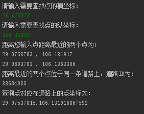

道路匹配就是将待匹配的点与已有的道路信息数据点进行关联，而道路信息数据点其实就是在二维平面上的许许多多的不同的点，因此道路匹配过程就转换成寻找节点在二维平面上的最邻近点。但是由于数据点的量十分庞大，简单的进行遍历搜索明显无法满足实时性的要求，因此需要利用K-D树算法来加速匹配过程。

K-D树（k-dimensional
Tree的简称），是一种分割k维数据空间的数据结构。主要应用于多维空间关键数据的搜索（如：范围搜索和最近邻搜索）。K-D树是二元空间分割树的特殊的情况。

在二元空间分割树（BSPTree）中，节点分割的是一维数轴，那么在二维中，就应当是分割平面了，如图1所示：

图1

黄色的点作为根节点，上面的点归左子树，下面的点归右子树，接下来再不断地划分，最后得到的就是BSPTree（binary space
partitioning tree）。分割的那条线叫做分割超平面（splitting
hyperplane），在一维中是一个点，二维中是线，三维中是面。

K-D树就是超平面都垂直于轴的BSPTree。同样的数据集，用K-D树划分之后如图2所示：

图2

在K-D树建立好之后，就可以对节点进行匹配。对节点的匹配操作这时就转换为求K-D树中离这个节点最近的节点(最邻近点)，如图3所示。由于地球是曲面的，因此直接利用欧几里得公式计算距离时，会存在一定的误差。因此在实际计算距离时，为了更加精确，我们首先分别将计算距离的两点经纬度转换为三维直角坐标，然后根据直角坐标求两点间的直线距离（即弦长），最后根据弦长求两点间的距离（即弧长），如图3所示。

图3

在图4所示的情况下，因为点到直线的最短距离为点与直线的垂线段的长度，所以图4所示的对应道路节点很明显并不是待匹配节点距离道路最近的节点。

图4

因此，此时考虑对节点匹配两个最邻近点，然后用待匹配节点与两个最邻近点之间线的垂点代表对应的道路节点。假设线段的两端点为pt1和pt2，则斜率k
= ( pt2.y - pt1. y ) / (pt2.x - pt1.x )。那么该直线的方程为：y = k\* ( x -
pt1.x) + pt1.y，其垂线的斜率为 - 1 / k，因此垂线方程为：y = (-1/k) \* (x -
point.x) + point.y。最后联立两直线方程解得垂点坐标为：

x = ( k\^2 \* pt1.x + k \* (point.y - pt1.y ) + point.x ) / ( k\^2 + 1)

y = k \* ( x - pt1.x) + pt1.y。

匹配过程如图5所示。

图5

此外，观察发现，从OpenStreetMap里导入的数据点在部分道路上存在一定的稀疏度，有可能会遇到如图6所示的问题。

图6

因此为了让算法在匹配时更加精确，考虑在稀疏点之间添加新点，保证两个道路数据点之间的最大距离为100米。改进后的匹配过程如图7所示。

图7

总结匹配算法下：首先利用从OpenStreetMap下载的道路信息数据建立K-D树。然后在新待匹配数据点到来时，通过二叉树搜索（比较待查询节点和分裂节点的分裂维的值，小于等于就进入左子树分支，等于就进入右子树分支直到叶子结点），顺着“搜索路径”找到最近邻的两个近似点，也就是与待查询点处于同一个子空间的叶子结点；然后再回溯搜索路径，并判断搜索路径上的结点的其他子结点空间中是否可能有距离查询点更近的数据点，如果有可能，则需要跳到其他子结点空间中去搜索（将其他子结点加入到搜索路径）。重复这个过程直到搜索路径为空。最后如果待匹配节点正好位于道路上则直接返回该点，否则利用得到的距离待匹配点最近邻的两个数据点，返回对应的道路节点。

最终的结果如图8所示：

图8
